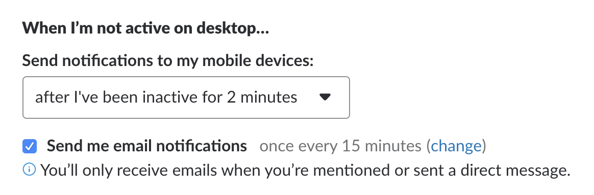

# Slack使用注意事项

## 规则

- 每天上午6点至12点之间，进行每日日程投票，让团队成员了解你今天的工作时间
- 每天至少查看4次Slack消息
- 在个人设置中，打开邮件提醒功能 
- 被@时，需要在12小时之内回应

## 客户端

- 建议使用电脑登陆网页版，并打开浏览器的通知功能
- 如果需要在视频会议中共享屏幕，需要使用桌面客户端板
- 手机app保持在线

## 消息浏览

- 在频道中，选中一条消息，然后点击聊天气泡图标，即可开启一个thread。如果是特别重要的消息，可以勾选同时发送到频道中，这样该条回复会同时出现在thread和频道中。
- All threads中可以看到自己参与的所有对话，以及最新的回复
- 点开频道详情时，可以看到Pinned Items，这里是被标记的重要信息
- 可以给自己认为重要的消息加星标

## 消息发送

- 使用频道，避免私聊
- 每条消息，最好都有@的对象
- 针对某一条消息的讨论，尽可能开启一个thread来进行

## 目前使用的插件

- Github 已经配置好，用于订阅Github项目，可以`/github help`来查看使用方法
- Trello 已经配置好，用于连接Trello看板，可以`/trello help`来查看使用方法
- Must-Read 已经配置好，在发送消息时`@must-read`即可
- Polly 已经配置好，用于创建投票，可以`/polly help`来查看使用方法
- Asana 已经配置好，可以点击消息，然后选择将其转化为Task，更多内容可以`/asana help`来查看
- Google Drive 已经配置好，可以上传Google Drive中的文件
- Quip 已经配置好，用于文档共享，可以`/quip help`来查看使用方法
